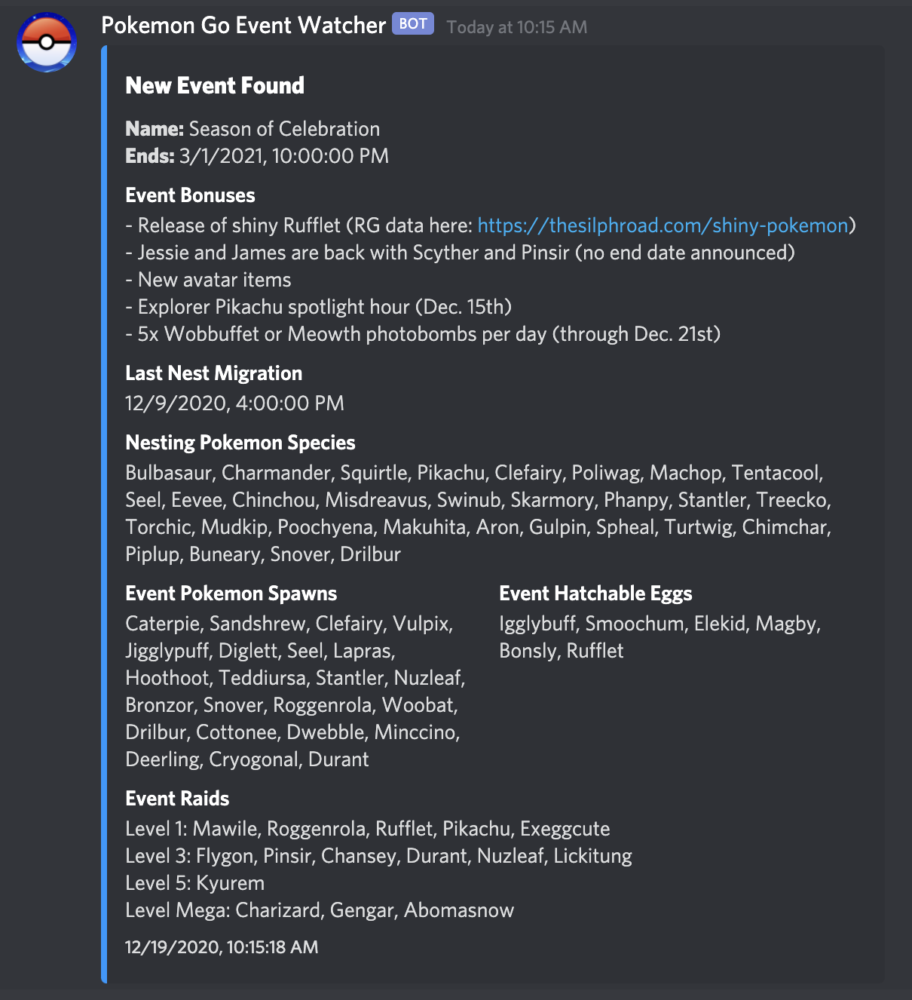

# Pokemon Go Event Watcher  

Uses [ccev/pogoinfo](https://github.com/ccev/pogoinfo) to check data for new event information.  

## Features
- Discord channel webhook upon new event data found (also DM).
- Discord commands to post all or only active events to a channel.  

## Installation  
1. Clone repository `git clone https://github.com/versx/EventWatcher && cd EventWatcher`  
1. Install dependencies `npm install`  
1. Copy config `cp src/config.example.json src/config.json`  
1. Fill out config.json  
1. Create locales `npm run create-locales`  
1. Start `npm start`  

## Configuration  
```json
{
    // Locale translations for Pokemon names
    "locale": "en",
    // Command prefix
    "prefix": "!",
    // Discord bot token
    "token": "<DISCORD_BOT_TOKEN>",
    // List of Discord channel ids to accept bot commands from
    "botChannelIds": ["0000000000000000"],
    // Owner Discord Id for owner only commands
    "ownerId": "0000000000000000",
    // List Discord user ids to send event changes to
    "userIds": ["0000000000000000"],
    // Discord user/role mention string for event changes embed
    "mention": "@0000000000000000",
    // Webhook channel urls to send event changes to
    "webhooks": [],
    // List of guilds to update active events channels with
    "guilds": [{
        // Guild ID
        "id": "0000000000000000",
        // Event category channel ID
        "eventsCategoryId": "0000000000000000"
    }]
}
```

## Commands
- Name: `events`  
- Description: `Replies with all events or only the active ones, optionally it'll send it to a specific channel.`
- Aliases: `e`  
- Arguments: `[active] [#channel_id]`  

Examples:  
```sh
# Send all events to #pogo-updates channel
!events #pogo-updates
# Send only active events to #pogo-updates channel
!events active #pogo-updates
```

## Previews  

