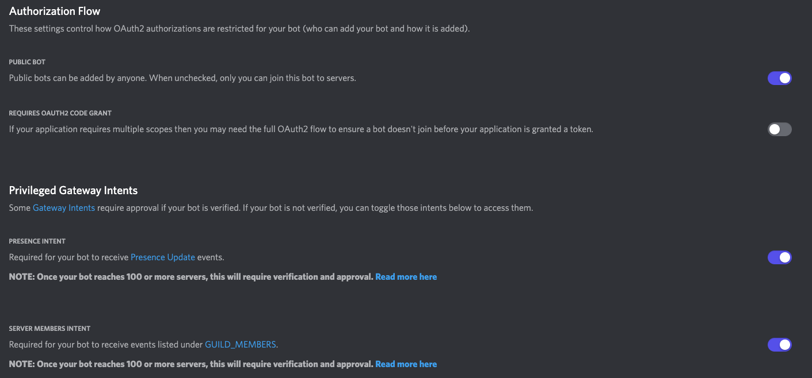
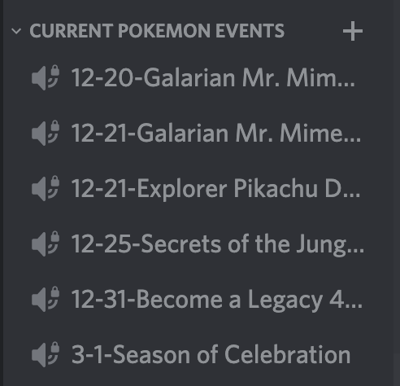

# Pokemon Go Event Watcher

Uses [ccev/pogoinfo](https://github.com/ccev/pogoinfo) to check data for new event information.

## Features

- Supports multiple Discord servers.
- Discord channel webhook upon new event data found (also DM).
- Discord commands to post all or only active events to a channel.

## Installation

1. Clone repository `git clone https://github.com/versx/EventWatcher && cd EventWatcher`
1. Install dependencies `npm install`
1. Copy config `cp src/config.example.json src/config.json`
1. Fill out config.json
1. Create locales `npm run create-locales`
1. Start `npm start`

## Running the app in Docker

1. Clone repository `git clone https://github.com/versx/EventWatcher && cd EventWatcher`
1. Copy config `cp src/config.example.json src/config.json`
1. Fill out config.json
1. Copy docker-compose.example.yml `cp docker-compose.example.yml cp docker-compose.yml`
1. Change according to your needs (defaults should work fine)
1. Run `docker-compose up -d` or run `docker-compose up -d --build` if you made changes to local files after the first Dockerbuild

## Configuration

```json
{
  // Locale translations for Pokemon names
  "locale": "en",
  // Command prefix
  "prefix": "!",
  // Discord bot token
  "token": "<DISCORD_BOT_TOKEN>",
  // List of Discord channel ids to accept bot commands from
  "botChannelIds": ["0000000000000000"],
  // Owner Discord Id for owner only commands
  "adminIds": ["0000000000000000"],
  // List of Discord user ids to send event changes to
  "userIds": ["0000000000000000"],
  // Discord user/role mention string for event changes embed
  "mention": "@0000000000000000",
  // Webhook channel urls to send event changes to
  "webhooks": [],
  // List of guilds to update active events channels with
  "guilds": [
    {
      // Guild ID
      "id": "0000000000000000",
      // Event category channel ID
      "eventsCategoryId": "0000000000000000"
    }
  ]
}
```

## Discord Bot Permissions

Event Voice Channels Category

- Manage Channel
- Manage Permissions

Posting Events

- Send Messages

You can use the following example URL to invite your bot to your server (you have to be admin)
`https://discord.com/oauth2/authorize?client_id=INSERT_CLIENT_ID_HERE&scope=bot&permissions=538110000`

Disclaimer:
1. Make sure you are admin of the Discordserver
1. On the "Bot" tab in Discord Developer Dashboard, make sure that the settings are as following:



## Commands

- Name: `events`
- Description: `Send all events or only active events to a specific channel.`
- Aliases: `e`
- Arguments: `<#channel_id> [active]`

Examples:

```sh
# Send all events to #pogo-updates channel
!events #pogo-updates
# Send only active events to #pogo-updates channel
!events #pogo-updates active
```

## Previews

  

